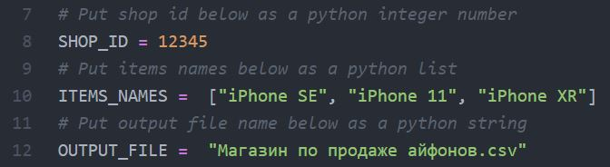
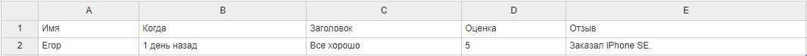

#  Парсер Onliner.by

Программа среди всех отзывов на магазин площадки onliner.by находит те, в которых упоминается конкретная модель товара, и сохраняет их.

## Настройка

Скачайте директорию проекта любым удобным для вас способом. В файле `parser.py` заполните id магазина, наименование товаров, упоминание которых вас интересует, а также имя файла, в который будут сохранены отзывы. Обратите внимание, что файл с отзывами должен иметь `.csv` расширение. 

Пример заполнения:



## Запуск

Для запуска программы вам понадобится интерпретатор Python 3 и библиотека requests.

Чтобы установить всё необходимое выполните:

### Linux

Откройте терминал в директории проекта и ввидите:

```bash
pip3 install -r requirements.txt
```

### Windows

Скачайте и установите интерпретатор [Python 3](https://www.python.org/downloads/), не забыв добавить его в **PATH**, затем откройте командную строку в директории проекта и ввидите:

```bash
pip install -r requirements.txt
```

После установки всего необходимого можно приступать к запуску:

### Linux

В терминале ввидите:

```bash
python3 parser.py 
```

### Windows

В командной строке ввидите:

```bash
python parser.py 
```

## Результат

В результате работы программы в директории проекта появится папка `results`, в которой будет находится файл с указанным вами именем. 

Файл будет содержать следующие столбцы:

